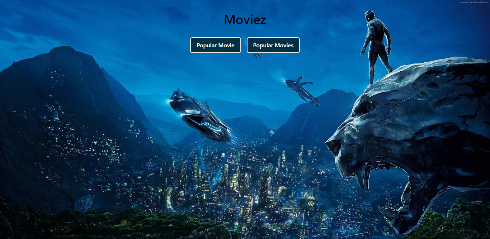

# Movies-AJAX
Movies web app using AJAX requests on JSON file

## Features
- Get single movie asynchronously
- Get multiple movies asynchronously

### Preview

### Screenshot

            This is a desktop View.

             This is for mobile view.

   
  

  
### Links

- [Live Site URL](https://am-moviez.netlify.app/)
- [Youtube](https://youtu.be/REcYiBcxNCU)

### Built with

- Semantic HTML5 markup
- TailwindCSS
- Vanilla JS(AJAX and DOM Manipulations)

## Author

- [Instagram](https://www.instagram.com/albert_sigsbert/)
- [LinkedIn](https://www.linkedin.com/in/albertsigsbert/)
- [Twitter](https://twitter.com/albert_sigsbert)
